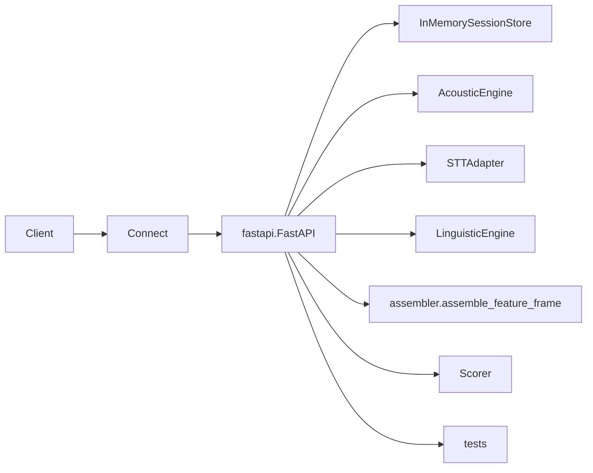
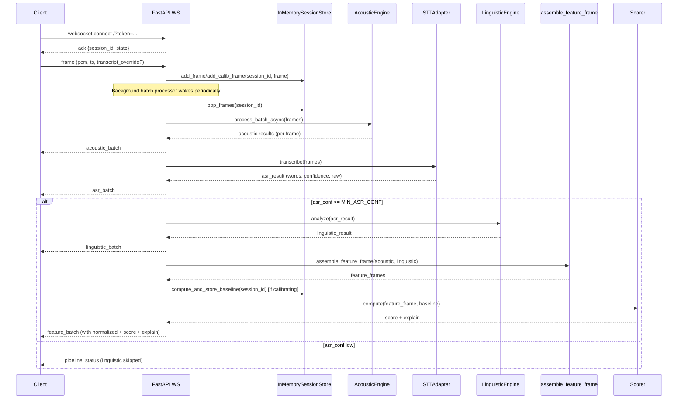
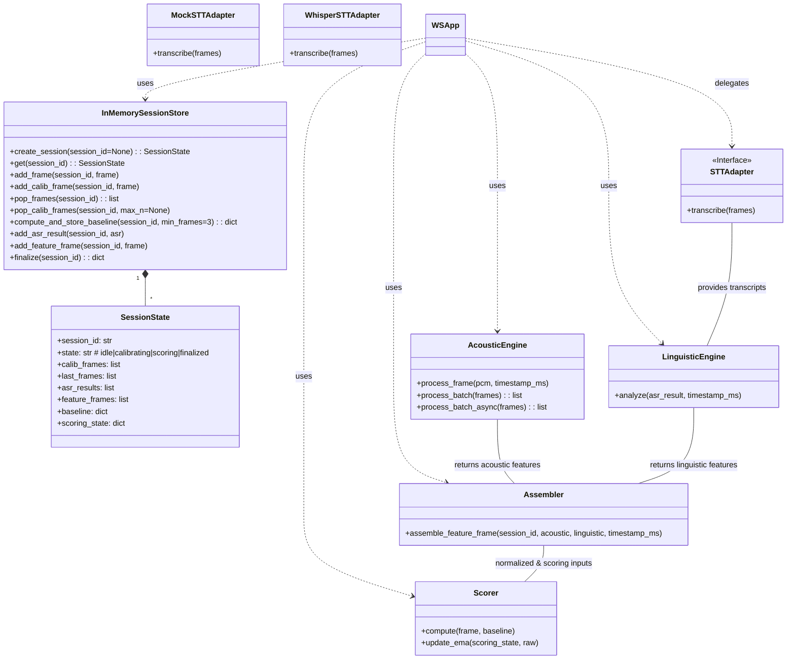
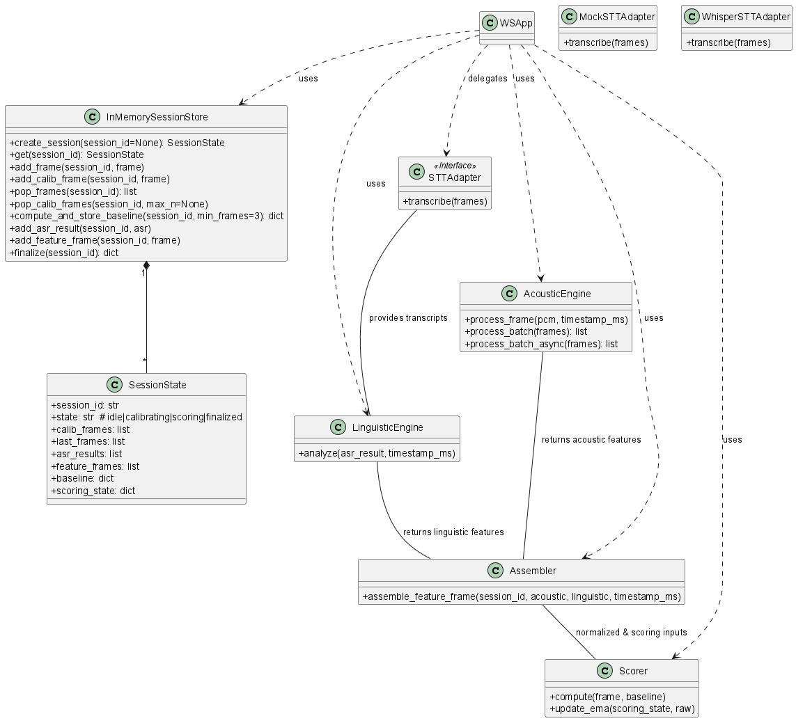
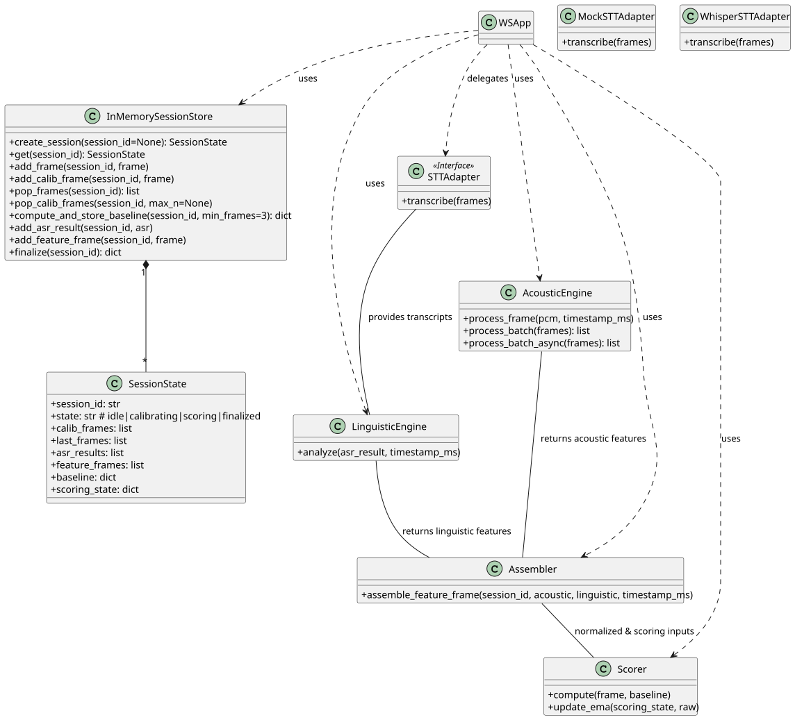

# VoiceCred — Architecture & UML

This document provides UML diagrams and sequence views to help contributors and AI agents understand the runtime flow and the main components of VoiceCred.

The content includes both Mermaid diagrams (renderable on GitHub & many editors) and PlantUML sources for classic UML tooling.

---

## Component Diagram (Mermaid)


### Notes
- `App` (FastAPI) orchestrates the pipeline: accepts frames via WS, persists them in `SessionStore`, runs acoustic extraction, STT, linguistic analysis, assembles features and triggers scoring.
- STT adapters are pluggable — tests default to `MockSTTAdapter` which supports `transcript_override` to provide deterministic transcripts for tests.

---

<!-- [MermaidChart: 76c27082-f609-4aa3-b222-d71a4855be6e] -->
<!-- [MermaidChart: 76c27082-f609-4aa3-b222-d71a4855be6e] -->
## High-level Sequence Diagram (Mermaid)


---

## PlantUML Class Diagram (source)
Below is a PlantUML class diagram source for key classes and their main public methods. You can paste it into an online PlantUML editor or generate PNG/SVG with PlantUML locally.



Replace `WSApp` with `FastAPI main` when rendering to annotate the orchestrating application.

---

## How to generate diagrams locally
If you want to render PlantUML diagrams locally, install PlantUML and Graphviz (for PNG/SVG output) and run:

```bash
# Example: generate PNG from PlantUML text file
plantuml -tpng docs/architecture.puml
```

### PNG / SVG exports

<!-- For SVG viewing: -->


For Mermaid diagrams, many Markdown editors (including GitHub) can automatically render them when enclosed in ` ```mermaid ` blocks.

---

## Notes for contributors & AI agents
- Use these diagrams when modeling interactions for new features or when changing message event types over WebSocket. Update the sequence diagram when changing the batch loop or gating logic in `main.py`.
- Keep `assemble_feature_frame` deterministic (feature names and `feature_version`) so baseline computation is stable across runs and tests.
- If you add a new STT or speaker adapter, update the component and class diagrams to keep documentation accurate.

---

If you'd like, I can add automated rendering to the repo (e.g., a `docs/diagrams/` folder with PNG exports, or a step in CI that generates diagram artifacts) — let me know which format you prefer (SVG/PNG/PlantUML/mermaid).
